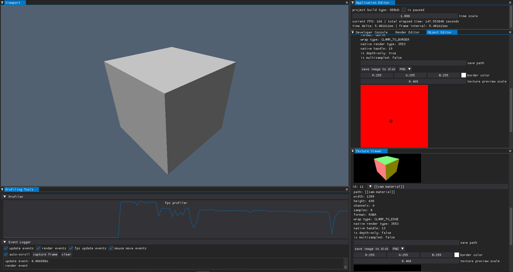

# Mx1Template

Этот репозиторий содержит готовый к использованию шаблон проекта, в котором используется [MxEngine](https://github.com/asc-community/MxEngine). Вы можете отредактировать
`CMakeLists.txt", чтобы настроить все остальное под свои нужды. Ниже вы можете увидеть шаги, необходимые для создания проекта

## Инструкция по использованию
[Перейти к инструкции](Manual.md)

## Подготовка
### Windows

1. Загрузите и установите CMake [Windowsx64](https://github.com/Kitware/CMake/releases/download/v3.31.0/cmake-3.31.0-windows-x86_64.msi)
2. Загрузите и установите LLVM [Windowsx64](https://github.com/llvm/llvm-project/releases/download/llvmorg-18.1.8/LLVM-18.1.8-win64.exe)
3. Установите Visual Studio Community 2019 [ссылка](https://apps.microsoft.com/detail/xp8cdjnzkfm06w?hl=en-us&gl=RU)
4. Загрузите пакеты для разработки на С++ в Visual Studio Installer:
   - Основные компоненты C++;
   - MSVC (C++ средства сборки x64/x86);
   - C++ AddressSanitazer;
   - Средства профилирования С++;
   - IntelliCode
Тут могут быть лишние пункты, но у меня с ними работает :D

## Установка
1. Склонируйте репозиторий
    ```bash
    git clone https://github.com/GrimDarkTech/Mx1Template
    ```
2. Перейдите в директорию проекта
    ```bash
    cd Mx1Template
    ```
2. Загрузите MxEngine
    ```bash
    git submodule update --init
    ```
3. Настройте сломанные зависимости в MxEngine\
    Перейдите в папку MxEngine
    ```bash
    cd MxEngine
    ```
    Замените в **.gitmodules** ссылку на модуль **assimp** (27 строка) с:
    ```
	url = https://github.com/MomoDeve/assimp
    ```
    на:
    ```
	url = https://github.com/assimp/assimp
    ```
4. Загрузите зависимости для MxEngine
    ```bash
    git submodule update --init
    ```
5. Отключите сборку примеров

    В директории **MxEngine** отредактируйте файл **CMakeLists.txt**:
    Замените:
    ```cmake
    if (MXENGINE_BUILD_SAMPLES)
        add_subdirectory(samples/SandboxApplication)
        add_subdirectory(samples/OfflineRendererSample)
        add_subdirectory(samples/PhysicsSample)
        add_subdirectory(samples/ProjectTemplate)
        add_subdirectory(samples/SoundSample)
        add_subdirectory(samples/VRCameraSample)
        add_subdirectory(samples/GrassSample)
        add_subdirectory(samples/Sponza)
        add_subdirectory(samples/PBR)
        add_subdirectory(samples/PathTracing)
        add_subdirectory(samples/Particles)
        add_subdirectory(samples/Doom)
    ```
    на:
    ```cmake
    if (MXENGINE_BUILD_SAMPLES)
    ```
6. Перейдите в корень проекта (в Mx1Template)
    ```bash
    cd ..
    ```
7. Создайте папку **build** для сборки проекта 
    ```bash
    mkdir build
    ```
8. Перейдите в папку **build**а 
    ```bash
    cd build
    ```
9. Выполните подготовку к сборке проекта, используя **CMake**
    ```bash
    cmake ..
    ```
10. Выполните сборку проекта, используя **CMake**
    ```bash
    cmake --build . --config Debug
    ```

<p align="center">

</p>
